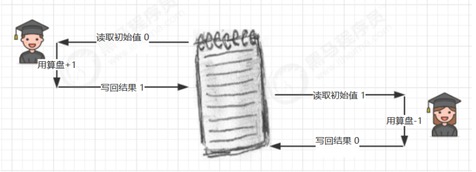
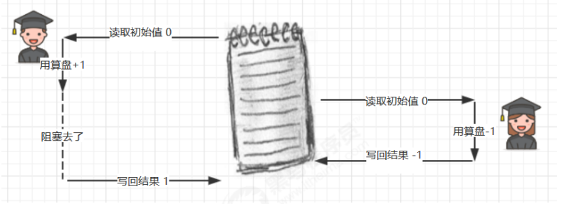

## JUC

> 推荐黑马： https://www.bilibili.com/video/BV16J411h7Rd


> 资料：

+ 并发编程.pdf
+ 并发编程_模式.pdf
+ 并发编程_应用.pdf
+ 并发编程_原理.pdf
+ 尚硅谷-JUC.md


> 如何学习

+ 自己来来回回切换看了50多级，对比下来，黑马更全一些，有助于循序渐进，尚硅谷通俗易懂一些
+ 看黑马视频和资料，不太明白的看尚硅谷资料
+ 加上自己思考
+ 字节码可以不用怎么看，了解就行，这些涉及到JVM


### 栈与栈帧

> Java Virtual Machine Stacks （Java 虚拟机栈） 

我们都知道 JVM 中由堆、栈、方法区所组成，其中栈内存是给谁用的呢？其实就是线程，每个线程启动后，虚拟机就会为其分配一块栈内存。 

+ 每个栈由多个栈帧（Frame）组成，对应着每次方法调用时所占用的内存 
+ 每个线程只能有一个活动栈帧，对应着当前正在执行的那个方法
+ 栈帧中含有：局部变量表、返回地址、锁记录


### 为什么要发生上下文切换？

因为以下一些原因导致 cpu 不再执行当前的线程，转而执行另一个线程的代码

+ 线程的 cpu 时间片用完 
+ 垃圾回收 
+ 有更高优先级的线程需要运行
+ **线程自己调用了 sleep、yield、wait、join、park、synchronized、lock 等方法**


当 Context Switch 发生时，需要由**操作系统保存当前线程的状态**，并恢复另一个线程的状态，Java 中对应的概念 就是程序计数器（Program Counter Register），它的作用是记住下一条 jvm 指令的执行地址，是线程私有的 

+ 状态包括程序计数器、虚拟机栈中每个栈帧的信息，如局部变量、操作数栈、返回地址等 
+ Context Switch 频繁发生会影响性能 


### 为什么多线程不安全？

> 原因就是：1.cpu以时间片形式执行线程，会发生**上下文切换**  2.多个线程**共享写**了同一个资源

+ 老王（操作系统）有一个功能强大的算盘（CPU），现在想把它租出去，赚一点外快 

+ 小南、小女（线程）来使用这个算盘来进行一些计算，并按照时间给老王支付费用

+ 但小南不能一天24小时使用算盘，他经常要小憩一会（sleep），又或是去吃饭上厕所（阻塞 io 操作），有 

  时还需要一根烟，没烟时思路全无（wait）这些情况统称为（阻塞） 

+ 在这些时候，算盘没利用起来（不能收钱了），老王觉得有点不划算 

+ 另外，小女也想用用算盘，如果总是小南占着算盘，让小女觉得不公平

+ 于是，老王灵机一动，想了个办法 [ 让他们每人用一会，轮流使用算盘 ] 

+ 这样，当小南阻塞的时候，算盘可以分给小女使用，不会浪费，反之亦然 

+ 最近执行的计算比较复杂，需要存储一些中间结果，而学生们的脑容量（工作内存）不够，所以老王申请了 

  一个笔记本（主存），把一些中间结果先记在本上

+ 计算流程是这样的 

  

+ 但是由于分时系统，有一天还是发生了事故

+ 小南刚读取了初始值 0 做了个 +1 运算，**还没来得及写回结果**

+ 老王说 [ 小南，你的时间到了，该别人了，记住结果走吧 ]，于是小南念叨着 [ 结果是1，结果是1...]（**保存到操作系统**） 不甘心地 到一边待着去了（上下文切换）

+ 老王说 [ 小女，该你了 ]，小女看到了笔记本上还写着 0 做了一个 -1 运算，将结果 -1 写入笔记本

+ 这时小女的时间也用完了，老王又叫醒了小南：[小南，把你上次的题目算完吧]，小南将他**脑海**(**操作系统**)中的结果 1 写入了笔记本

+ 

+ 小南和小女都觉得自己没做错，但笔记本里的结果是 1 而不是 0


### Monitor原理

加锁的this，指针指向monitor对象（也成为冠城或监视器锁）的起始地址。每个对象都存在一个monitor与之关联，当一个monitor被某个线程持有后，它便处于锁定状态。在Java虚拟机中(HotSpot)中，monitor是由ObjectMonitor实现的，其主要数据结构如下(ObjectMpnitor.hpp文件，C++实现的)


> Monitor流程-加锁


> Monitor流程-解锁


### 六种状态

参考：./并发编程.pdf/3.13六种状态 ；./并发编程.pdf/4.10 重新理解线程状态转换

+ IDEA中线程调试，RUNNABLE展示的是RUNNING，BLOCKED展示的是MONITOR


### 轻量级锁使用在无竞争场景，那么为什么还要用它？

+ 无竞争是事后才知道的 
+ 开始没并发，线程一个执行完了过了会才来一个，这时候是轻量锁，然后程序跑着跑着并发来了，锁就升级了 
+ 使用锁的目的是为了保证竞争下面的数据安全，这个是大前提。
  但是在某些场景下，竞争可能不存在或者不激烈。这种情况下，使用重量级锁性能不佳，也没有必要
  轻量级锁 是优化处理这种情况。后面可能会有的 线程的竞争，就会有锁升级的情况发生。 


### synchronized锁的理解

参考：[synchronized锁的理解](https://blog.csdn.net/Ryanqy/article/details/105351282)   [加深理解](https://blog.dreamtobe.cn/2015/11/13/java_synchronized/)  [偏向锁理解](https://blog.csdn.net/m0_37540696/article/details/113247587)

+ 在第一个线程要求获取对象监视器锁时，会被处于偏向锁状态。
+ 过了一会，第二个线程来请求锁时，偏向锁会被撤销，监视器锁会膨胀为轻量级锁。
+ 最后当有线程在自旋了指定次数后仍然未获取锁，该对象监视器锁就会膨胀为重量级锁。


### JAVA内存模型之JMM

参考：./尚硅谷-JUC.md/九、Java内存模型之JMM

> 由于JVM运行程序的实体是线程，而每个线程创建时JVM都会为其创建一个工作内存(有些地方称为栈空间)，工作内存是每个线程的私有数据区域，而Java内存模型中规定所有变量都存储在主内存，主内存是共享内存区域，所有线程都可以访问，但线程对变量的操作(读取赋值等)必须在工作内存中进行，首先要将变量从主内存拷贝到的线程自己的工作内存空间，然后对变量进行操作，操作完成后再将变量写回主内存，不能直接操作主内存中的变量，各个线程中的工作内存中存储着主内存中的变量副本拷贝，因此不同的线程间无法访问对方的工作内存，线程间的通信(传值)必须通过主内存来完成

#### 1. 先行发生原则说明 

+ 如果Java内存模型中所有的有序性都仅靠volatile和synchronized来完成，那么有很多操作都将会变得非常啰嗦，但是我们在编写Java并发代码的时候并没有察觉到这一点。
+ 我们没有**时时、处处、次次**，添加volatile和synchronized来完成程序，这是因为Java语言中JMM原则下有一个“先行发生”(Happens-Before)的原则限制和规矩
+ 这个原则非常重要： 它是判断数据是否存在竞争，线程是否安全的非常有用的手段。依赖这个原则，我们可以通过几条简单规则一揽子解决并发环境下两个操作之间是否可能存在冲突的所有问题，而不需要陷入Java内存模型苦涩难懂的底层编译原理之中。

#### 2. happens-before总原则

- 如果一个操作happens-before另一个操作，那么第一个操作的执行结果将对第二个操作可见，而且第一个操作的执行顺序排在第二个操作之前。
- 两个操作之间存在happens-before关系，并不意味着一定要按照happens-before原则制定的顺序来执行。如果重排序之后的执行结果与按照happens-before关系来执行的结果一致，那么这种重排序并不非法。
  - 1+2+3 = 3+2+1
  - 周一张三周二李四，假如有事情调换班可以的
  - 简单来说，操作2没有依赖操作1，就可以发生重排序


### synchronized不能防止指令重排序

参考：https://blog.csdn.net/Hellowenpan/article/details/117750543

+ `volatile`能保证内存可见性、**禁止指令重排序**但是不能保证[原子性](https://so.csdn.net/so/search?q=原子性&spm=1001.2101.3001.7020)。

  `synchronized`能保证原子性、可见性和**有序性(串行执行)**。

+ synchronized保证顺序性是指的将并发执行变成了串行，但并不能保证内部指令重排序问题。


### double-checked locking问题

+ t1线程可能会发生重排序，先把引用赋值给了静态变量（此时对象还没调用构造方法，该对象还不是一个完整的对象）
+ 此时t2线程开始运行了，当t2线程执行到`if (INSTANCE == null)`(第16行代码)语句的时候，t2线程发现`INSTANCE`不为空，此时t2线程直接返回INSTANCE对象。但是此时该对象还是一个不完整的对象，在t2线程使用该对象的时候就会出现问题，发现引用的对象为null。
+ DCL中如果不加volatile，t2返回的对象也是一个引用(值为null)，如果等待t1调用完构造方法，t2的对象是不是也是有值的(引用类型) ， 为了更保险起见(t1调用构造方法特别慢)，所以加了volatile 

```java
public final class Singleton {
    private Singleton() { }
    private static volatile Singleton INSTANCE = null;
    public static Singleton getInstance() {
        if (INSTANCE == null) { // t2
            synchronized (Singleton.class) { 
                if (INSTANCE == null) { 
                    INSTANCE = new Singleton();// t1
                }
            }
        }
        return INSTANCE;
    }
}
```


### LongAdder原理

+ LongAdder的基本思路就是分散热点，将value值分散到一个Cell数组中，不同线程会命中到数组的不同槽中，各个线程只对自己槽中的那个值进行CAS操作，这样热点就被分散了，冲突的概率就小很多。如果要获取真正的long值，只要将各个槽中的变量值累加返回。

+ sum()会将所有Cell数组中的value和base累加作为返回值，核心的思想就是将之前AtomicLong一个value的更新压力分散到多个value中去，
  从而降级更新热点。

+ 内部有一个base变量，一个Cell[]数组。

  base变量：非竞态条件下，直接累加到该变量上

  Cell[]数组：竞态条件下，累加个各个线程自己的槽Cell[i]中

+ LongAdder在无竞争的情况，跟AtomicLong一样，对同一个base进行操作，当出现竞争关系时则是采用化整为零的做法，从空间换时间，用一个数组cells，将一个value拆分进这个数组cells。多个线程需要同时对value进行操作时候，可以对线程id进行hash得到hash值，再根据hash值映射到这个数组cells的某个下标，再对该下标所对应的值进行自增操作。当所有线程操作完毕，将数组cells的所有值和无竞争值base都加起来作为最终结果。