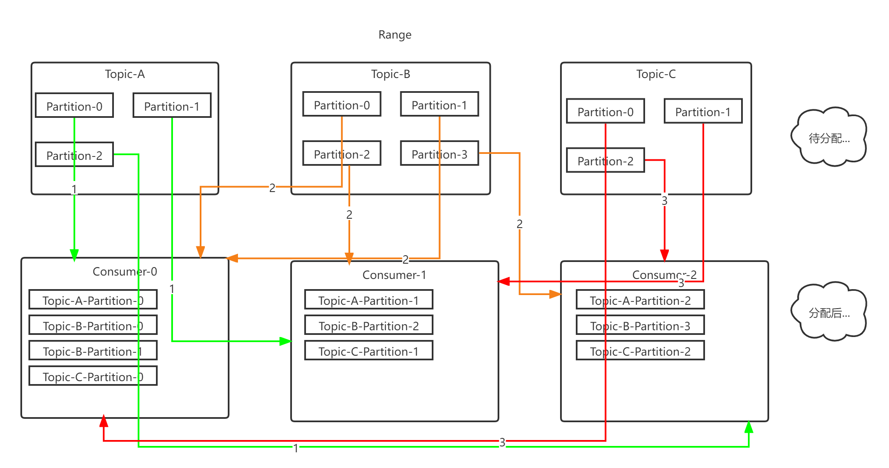
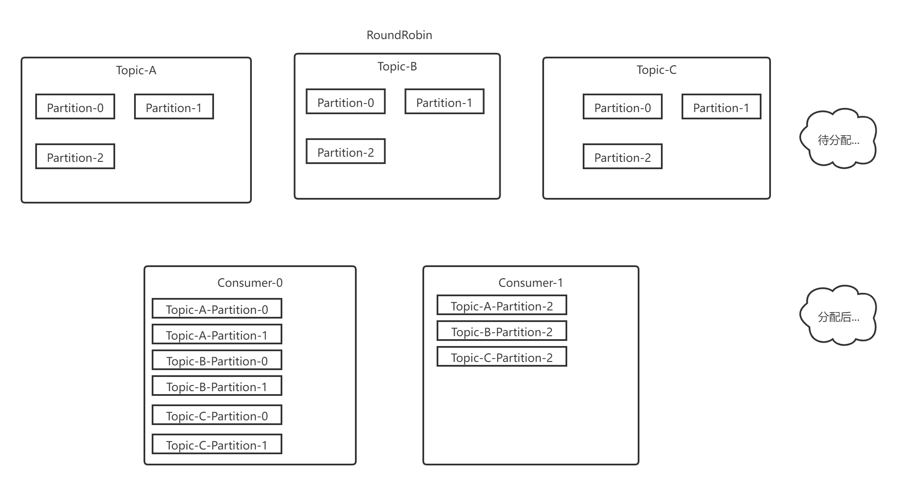
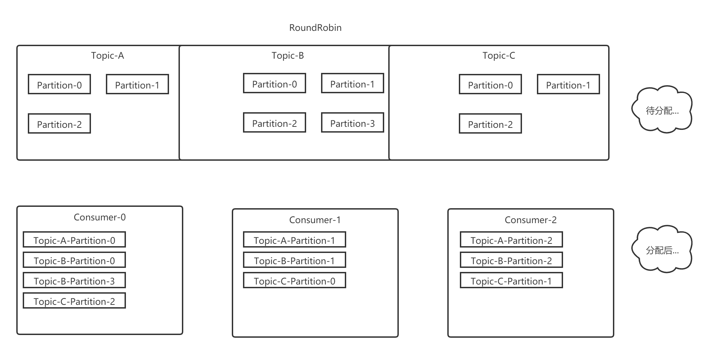
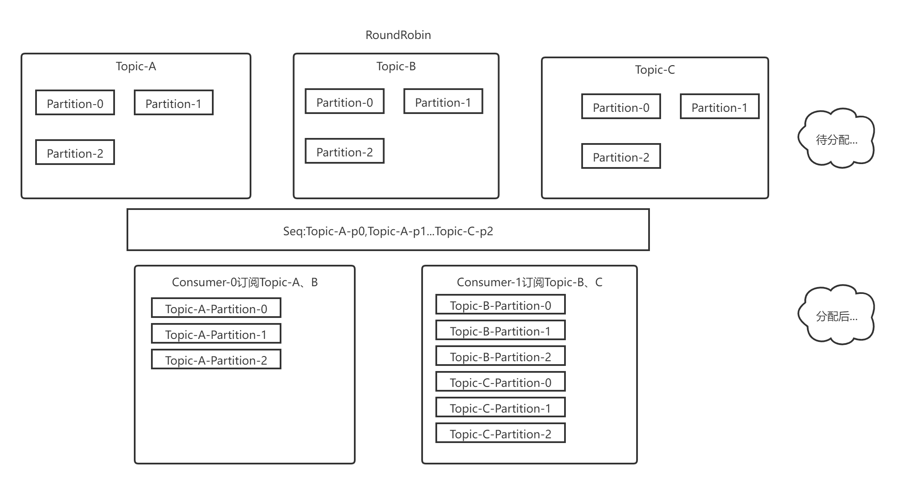

## kafka的消费者分区分配策略

kafka有三种分区分配策略

1. Range
2. RoundRobin
3. Sticky


### 一、Range(默认的分配策略)

Range策略不同于RoundRobin之处在于Range策略是面向Topic分配的(RoundRobin面向Partition)，假设顺序为Topic-A, Topic-B,Topic-C，那么分配过程为：

------

+ 第一轮: 
  + Consumer-0: Topic-A-Partition0
  + Consumer-1: Topic-A-Partition1
  + Consumer-2: Topic-A-Partition2

+ 第二轮: 
  + Consumer-0: Topic-A-Partition0, **Topic-B-Partition0, Topic-B-Partition1**
  + Consumer-1: Topic-A-Partition1, **Topic-B-Partition2**
  + Consumer-2: Topic-A-Partition2, **Topic-B-Partition3**

+ 第三轮: 
  + Consumer-0: Topic-A-Partition0, Topic-B-Partition0, Topic-B-Partition1, **Topic-C-Partition-0**
  + Consumer-1: Topic-A-Partition1, Topic-B-Partition2, **Topic-C-Partition-1**
  + Consumer-2: Topic-A-Partition2, Topic-B-Partition3, **Topic-C-Partition-2**

------

最终结果如图，很明显我们可以看到它的特点是以topic为主进行划分的，假设消费者数量为N，主题分区数量为M，则有当前主题分配数量 = M%N==0? M/N +1 : M/N ;



 Range策略的缺点在于如果Topic足够多、且分区数量不能被平均分配时，会出现消费过载的情景，举一个例子



 可以看到此种情况已经相差3个分区，如果主题进一步扩大差距会愈发明显。


### 二、RoundRobin

RoundRobin策略很简单~假设我们有三个Topic10个Partition，上图！

假设顺序为A-0,A-1,A-2...C-2



不难看出轮询策略是将partition当做最小分配单位，将所有topic的partition都看作一个整体。然后为消费者轮询分配partition。当然得到此结果的前提是Consumer Group种的消费者订阅信息是一致的，如果订阅信息不一致，得到的结果也不均匀，下面举个例子：


如图，Consumer0订阅Topic-A、B，Consumer1订阅Topic-B、C，顺序注意图中的Seq，先分配TopicA

------

+ 第一轮 : 
  + Consumer-0: Topic-A-Partition0
  + 由于Consumer-1没有订阅Topic-A，所以只能找到Topic-B给Consumer-1分配
  + 于是 Consumer-1: Topic-B-Partition0

+ 第二轮: 
  + Consumer-0: Topic-A-Partition0, **Topic-A-Partition1**
  + Consumer-1: Topic-B-Partition0, **Topic-B-Partition1**

+ 第三轮: 
  + Consumer-0: Topic-A-Partition0, Topic-A-Partition1，**Topic-A-Partition2**
  + Consumer-1: Topic-B-Partition0, Topic-B-Partition1，**Topic-B-Partition2**

+ 第四、五、六轮：

  + Consumer-0: Topic-A-Partition0, Topic-A-Partition1, Topic-A-Partition2

  + Consumer-1: Topic-B-Partition0, Topic-B-Partition1, Topic-B-Partition2, **Topic-C-Partition-0, Topic-C-Partition-1, Topic-C-Partition-2**

------------------------------------------------------------------------------------------------------

可以看到Consumer-1多消费了3个分区。所以在Consumer Group有订阅消息不一致的情况下，我们最好不要选用RoundRobin。


> PS：

RoundRobin模式，第二张图中，如果Topic-B有4个分区，第四轮Consumer-0分配是不是应该这样：Topic-A-Partition0, Topic-A-Partition1, Topic-A-Partition2, **Topic-B-Partition3** 


### 三、Sticky

kafka在0.11版本引入了Sticky分区分配策略，它的两个主要目的是:

1.分区的分配要尽可能的均匀，分配给消费者者的主题分区数最多相差一个；

2.分区的分配尽可能的与上次分配的保持相同。

当两者发生冲突时，第一个目标优先于第二个目标。以RoundRobin的不均衡为例，



 此时的结果明显非常不均衡，如果使用Sticky策略的话结果应该是如此：


在这里我给出实际测试结果参考，稍后会将代码贴出供读者自行测试。

Sticky：

+ consumer-0:

  ```
  topic :Topic-A;;;partition:2
  topic :Topic-A;;;partition:1
  topic :Topic-B;;;partition:2
  topic :Topic-A;;;partition:0
  topic :Topic-B;;;partition:0
  ```

+ consumer-1:

  ```
  topic :Topic-B;;;partition:1
  topic :Topic-C;;;partition:1
  topic :Topic-C;;;partition:0
  topic :Topic-C;;;partition:2
  ```

  

1. 导入kafka依赖

   ```
    <dependency>
          <groupId>org.apache.kafka</groupId>
          <artifactId>kafka_2.12</artifactId>
          <version>1.1.1</version>
    </dependency>
   ```

2. 启动zookeeper，启动kafka；

3. 命令行切换到kafka目录下；执行以下命令创建Topic & partition

   ```
   kafka-topics.bat --create --zookeeper 127.0.0.1:2181 --replication-factor 2 --partitions 3 --topic Topic-A
   
   kafka-topics.bat --create --zookeeper 127.0.0.1:2181 --replication-factor 2 --partitions 3 --topic Topic-B
   
   kafka-topics.bat --create --zookeeper 127.0.0.1:2181 --replication-factor 2 --partitions 3 --topic Topic-C
   ```

   

测试代码：

+ consumer-0:

  ```java
    public static void main(String[] args) {
          Properties properties = new Properties();
          properties.put(ConsumerConfig.BOOTSTRAP_SERVERS_CONFIG, "127.0.0.1:9092,127.0.0.1:9092,127.0.0.1:9092");
          properties.put(ConsumerConfig.KEY_DESERIALIZER_CLASS_CONFIG, StringDeserializer.class);
          properties.put(ConsumerConfig.VALUE_DESERIALIZER_CLASS_CONFIG, StringDeserializer.class);
          properties.put(ConsumerConfig.GROUP_ID_CONFIG, "group-0");
          //设置分配策略
          properties.put(ConsumerConfig.PARTITION_ASSIGNMENT_STRATEGY_CONFIG,RangeAssignor.class.getName());
   
          KafkaConsumer<String, String> consumer = new KafkaConsumer<>(properties);
   
          consumer.subscribe(Arrays.asList("Topic-A","Topic-B"), new ConsumerRebalanceListener() {
   
              @Override
              public void onPartitionsRevoked(Collection<TopicPartition> collection) {
                  System.err.println("onPartitionsRevoked=========================================== ");
                  for (TopicPartition pt: collection
                       ) {
                      System.err.println("topic :"+pt.topic() + ";;;partition:"+pt.partition());
                  }
              }
   
              @Override
              public void onPartitionsAssigned(Collection<TopicPartition> collection) {
                  System.err.println("onPartitionsAssigned=========================================== ");
                  for (TopicPartition pt: collection
                  ) {
                      System.err.println("topic :"+pt.topic() + ";;;partition:"+pt.partition());
                  }
              }
   
              @Override
              public void onPartitionsLost(Collection<TopicPartition> partitions) {
                  ConsumerRebalanceListener.super.onPartitionsLost(partitions);
              }
          });
   
          while (true) {
              ConsumerRecords<String, String> records = consumer.poll(Duration.ofMillis(100));
              for (ConsumerRecord<String, String> record : records) {
   
                  System.out.printf("offset = %d, key = %s, value = %s%n", record.offset(), record.key(), record.value());
                  TopicPartition topicPartition = new TopicPartition(record.topic(), record.partition());
              }
          }
      }
  ```

  

+ consumer-1

  ```java
    public static void main(String[] args) {
          Properties properties = new Properties();
          properties.put(ConsumerConfig.BOOTSTRAP_SERVERS_CONFIG, "127.0.0.1:9092,127.0.0.1:9092,127.0.0.1:9092");
          properties.put(ConsumerConfig.KEY_DESERIALIZER_CLASS_CONFIG, StringDeserializer.class);
          properties.put(ConsumerConfig.VALUE_DESERIALIZER_CLASS_CONFIG, StringDeserializer.class);
          properties.put(ConsumerConfig.GROUP_ID_CONFIG, "group-0");
          //设置分配策略
          properties.put(ConsumerConfig.PARTITION_ASSIGNMENT_STRATEGY_CONFIG,RangeAssignor.class.getName());
   
          KafkaConsumer<String, String> consumer = new KafkaConsumer<>(properties);
   
          consumer.subscribe(Arrays.asList("Topic-B","Topic-C"), new ConsumerRebalanceListener() {
   
              @Override
              public void onPartitionsRevoked(Collection<TopicPartition> collection) {
                  System.err.println("onPartitionsRevoked=========================================== ");
                  for (TopicPartition pt: collection
                       ) {
                      System.err.println("topic :"+pt.topic() + ";;;partition:"+pt.partition());
                  }
              }
   
              @Override
              public void onPartitionsAssigned(Collection<TopicPartition> collection) {
                  System.err.println("onPartitionsAssigned=========================================== ");
                  for (TopicPartition pt: collection
                  ) {
                      System.err.println("topic :"+pt.topic() + ";;;partition:"+pt.partition());
                  }
              }
   
              @Override
              public void onPartitionsLost(Collection<TopicPartition> partitions) {
                  ConsumerRebalanceListener.super.onPartitionsLost(partitions);
              }
          });
   
          while (true) {
              ConsumerRecords<String, String> records = consumer.poll(Duration.ofMillis(100));
              for (ConsumerRecord<String, String> record : records) {
   
                  System.out.printf("offset = %d, key = %s, value = %s%n", record.offset(), record.key(), record.value());
                  TopicPartition topicPartition = new TopicPartition(record.topic(), record.partition());
              }
          }
      }
  ```

  


